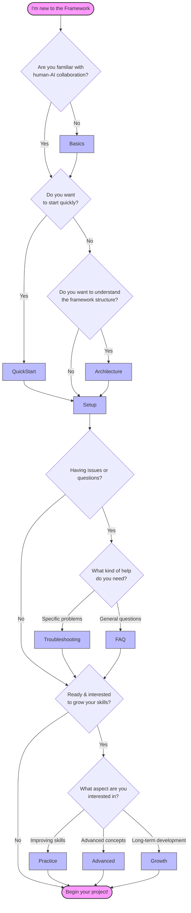

# Human-AI Collaboration Framework

Welcome to a framework that transforms how you work with AI. This isn't just another productivity tool - it's a pathway to deepening both your work and your capabilities as you collaborate with AI.

## Is This Framework For You?

You might find this framework valuable if you:

- Work on complex projects that require deep thinking and creativity
- Want to use AI as a genuine thought partner rather than just a tool
- Are interested in growing your own capabilities alongside AI
- Value systematic approaches to knowledge and project development

The framework helps you move beyond using AI for simple tasks, instead creating a structure for meaningful collaboration that enhances both your work and your own development.

## What to Expect

This framework will change how you work with AI in fundamental ways:

### Shifting Focus

- Less time spent on routine research and organization
- More energy for critical thinking and evaluation
- Greater emphasis on judgment and strategic planning
- Deeper engagement with the quality and direction of your work

### Growing Responsibility

As you work with AI more deeply, you'll find yourself:

- Taking ownership of two interlinked thinking processes
- Developing stronger critical evaluation skills
- Making more nuanced strategic decisions
- Growing your capacity for reflection and metacognition

### Time Investment

- Initial setup: 2-3 hours
- Learning curve: 1-2 weeks of regular use
- Ongoing refinement: Continuous but integrated into your work

## Getting Started

Here is a simple decision flowchart that charts the territory of the repository and helps you find your way - either to additional theoretical underpinnings of this template, or how to get into concrete practice right away:

-----------

### Direct links to each file

1. Begin with [Understanding the Basics](docs/01_basics.md) to grasp the core concepts
2. Review the [Quick Start Guide](docs/02_quickstart.md) for essential setup steps
3. Set up your first project following the [Setup Guide](docs/03_setup.md)
4. Explore [Growing with the Framework](docs/04_growth.md) as you progress
5. Understand the interactions and conepts behind the[Framework Components](/docs/05_architecture.md)
6. Familiarise yourself with [Advanced Topics](/docs/06_advanced.md) by accessing reflective cognitive processes, meta-rationality and -project management
7. Find short answer to [Common Questions](/docs/07_faq.md) that may arise
8. If you run into problems, consult the  [Troubleshooting Guide](/docs/08_troubleshooting.md)
9. In a parallel move to point 6, learn how  [How to practice usage](/docs/09_practice.md) - in effect, how to learn

-----------

## Core Principles

This framework is built on several key insights about human-AI collaboration:

1. **Enhanced Agency**: While AI handles many routine tasks, your role becomes more important, not less. You guide the overall direction, evaluate outputs, and ensure quality.

2. **Metacognitive Development**: Working with AI effectively requires developing your abilities to:
   - Think critically about thinking processes
   - Evaluate information and approaches
   - Make strategic decisions
   - Reflect on and improve methods

3. **Conscious Partnership**: Understanding the nature of AI collaboration helps you:
   - Work more effectively within the partnership
   - Maintain appropriate boundaries
   - Take responsibility for outcomes
   - Grow from the experience

## Contributing

This framework is under active development. We welcome contributions and feedback through:

- Issue reports
- Feature suggestions
- Documentation improvements
- Experience sharing

There is no formal way of contributing now, but Feedback and getting into contact would be deeply appreciated!

## License

This project is licensed under the MIT License - see the [LICENSE](LICENSE) file for details.
