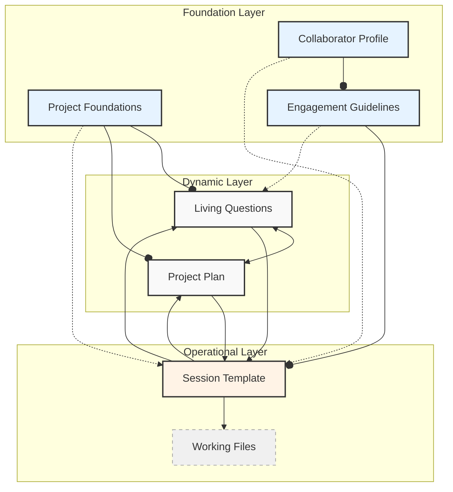
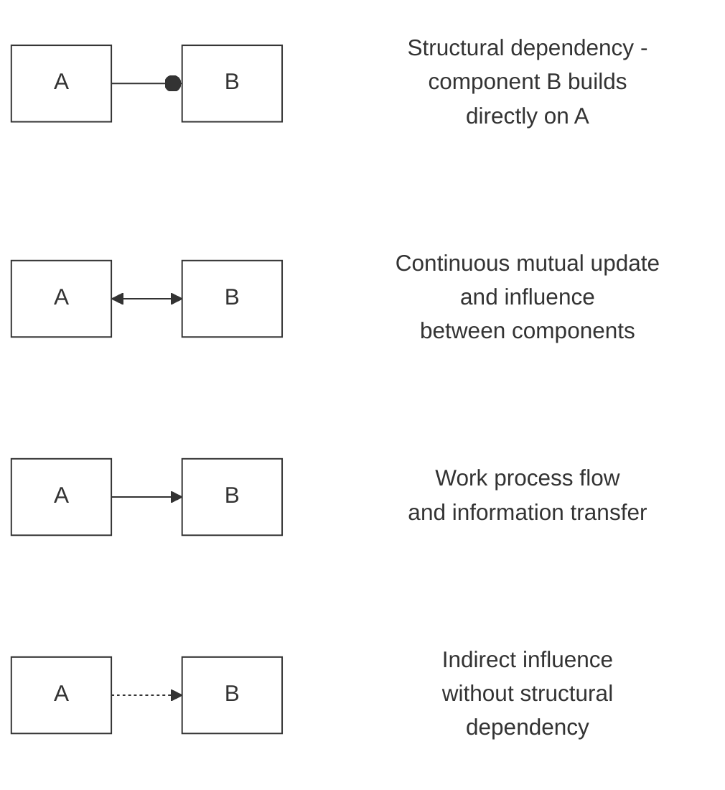

# Framework Architecture

The framework's architecture provides a structured approach to human-AI collaboration while maintaining flexibility for different needs and working styles. This document explains how the different components work together to support effective collaboration.

## Core Architecture Overview

The framework is organized into three main layers, each serving distinct but interconnected purposes. Think of these layers as the foundation, living space, and daily activities of a house - each builds upon the others to create a complete system.

### Foundation Layer

This layer establishes the basic structure for all collaboration. It includes:

Project Foundations:

- Defines core project parameters
- Establishes working principles
- Sets quality standards
- Creates basic infrastructure

Collaborator Profile:

- Documents working preferences
- Records expertise and experience
- Notes learning objectives
- Tracks development patterns

Engagement Guidelines:

- Establishes collaboration patterns
- Defines communication approaches
- Sets documentation standards
- Creates quality frameworks

### Dynamic Layer

This layer manages the evolving aspects of your work. It contains:

Living Questions:

- Tracks knowledge development
- Records open inquiries
- Documents insights
- Maintains understanding

Project Plan:

- Organizes work components
- Manages timelines
- Tracks progress
- Coordinates resources

### Operational Layer

This layer handles day-to-day collaboration. It includes:

Session Template:

- Structures individual sessions
- Maintains continuity
- Tracks progress
- Documents developments

Working Files:

- Contains project work
- Holds documentation
- Stores resources
- Maintains outputs

## Component Relationships

Understanding how components relate helps you use them more effectively:

### Direct Dependencies

Some components build directly on others:

- Project Foundations inform Living Questions and Project Plan
- Collaborator Profile shapes Engagement Guidelines
- Engagement Guidelines structure Session Template

### Bidirectional Updates

Some components continuously influence each other:

- Living Questions and Project Plan evolve together
- Session experiences update Living Questions
- Project progress refines Project Plan

### Influence Relationships

Some components indirectly affect others:

- Engagement Guidelines influence Living Questions
- Collaborator Profile shapes Session Template
- Project Foundations guide overall development

## Practical Implementation

### Starting Simple

Begin with basic implementations:

1. Create minimal versions of each component
2. Focus on essential relationships
3. Add complexity gradually
4. Maintain clear documentation

### Growing Complexity

As your work develops:

1. Deepen component implementations
2. Strengthen relationships
3. Add sophisticated features
4. Maintain integration

### Quality Assurance

Throughout development:

1. Verify component effectiveness
2. Check relationship health
3. Validate integration
4. Ensure clarity

## Evolution and Maintenance

### Regular Review

Maintain system health through:

1. Component effectiveness checks
2. Relationship verification
3. Integration validation
4. Documentation updates

### Continuous Improvement

Support system development by:

1. Identifying enhancement needs
2. Planning improvements
3. Implementing changes
4. Validating results

## Advanced Considerations

### System Flexibility

The architecture supports:

- Different project types
- Various working styles
- Multiple complexity levels
- Diverse implementation approaches

### Integration Points

Key areas for integration:

- Component connections
- Information flow
- Process alignment
- Quality assurance

### Evolution Support

The system enables:

- Component development
- Relationship refinement
- Integration enhancement
- Capability growth

Remember that this architecture serves as a guide rather than a rigid structure. Adapt it to your needs while maintaining its essential principles and relationships.
